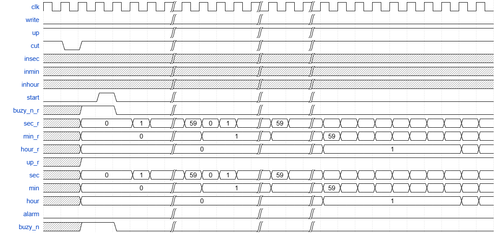
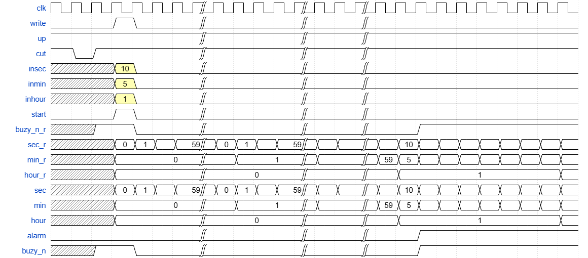
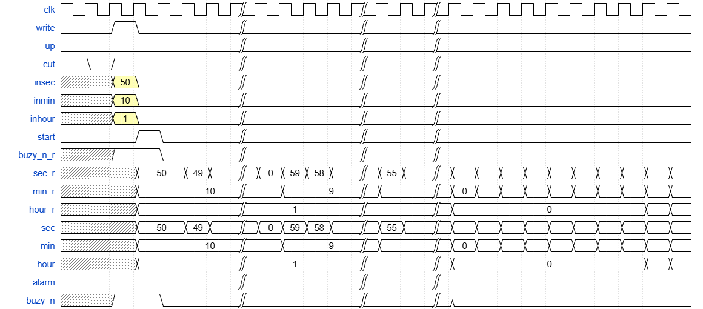
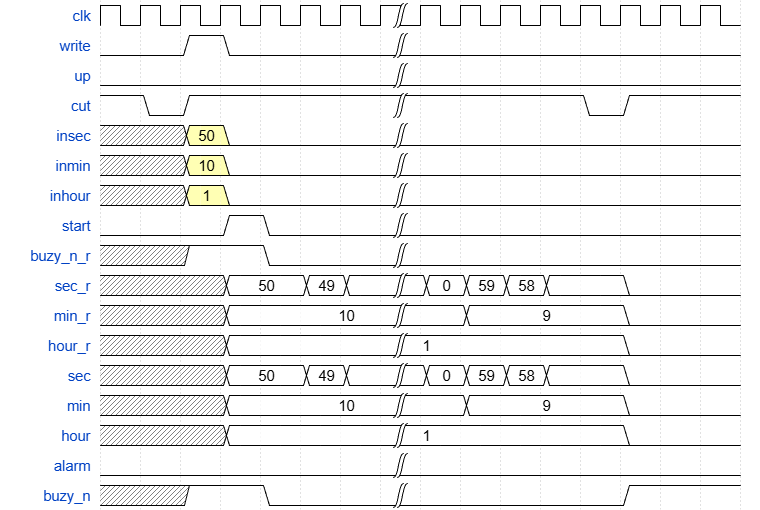

# 计时器模块设计文档

## 信号说明

```verilog
module timer(
  input clk,
  input write,//高电平有效，当这个信号亮起时，insec，inmin ,inhour,up 信号才有效，才能被正确写入
  input up , //计数方向控制（1=正计时，0=倒计时）
  input cut_n,//低电平有效，复位/中断信号
  input insec,
  input inmin ,
  input inhour,
  input start, //这个信号亮起，才会开始正计时或者倒计时
  output sec,
  output min,
  output hour,
  output alarm,//这个信号亮起代表正计时或者倒计时结束
  output buzy_n //在这个信号为低电平的时候，所有的写入信号都无法生效，只有使用cut_n信号中止计时之后才能让机器中止运转并接收新的写入信号
);
reg sec_set,min_set,hour_set;
reg buzy_n_r_last;
reg sec_set,min_set,hour_set;
assign alarm=(!buzy_n_r_last&&buzy_n_r)&&
  ((up_r&&sec_r==sec_set&&min_r=min_set&&hour_r==hour_set)||
    (!up_r&&sec_r==0&&min_R==0&&hour_r==0));
  
endmodule

```
## 单纯正计时模式
https://wavedrom.com/editor.html


```ts
{signal: [
	//input
    {name: 'clk', 	wave: 'p......|....|..|..........'},
    {name: "write",	wave: "0......|....|..|.........."},

    {name: "up" , 	wave: "x......|....|..|.........."},
    {name: "cut" , 	wave: "101....|....|..|.........."},//low as reset or cutin
    {name: "insec", wave: "x......|....|..|.........."},
    {name: "inmin", wave: "x......|....|..|.........."},
    {name: "inhour",wave: "x......|....|..|.........."},
    {name:"start",  wave: "0..10..|....|..|.........."},
  	// inside variables
    {name:"buzy_n_r",wave:"x.1.0..|....|..|.........."},
    {name: "sec_r", 	wave: "x.=..==|====|==|==========", "data": ["0","1","","59","0","1","","59"]},
    {name: "min_r", 	wave: "x.=....|.=..|=.|==========", "data": ["0","1","","59"]},
    {name: "hour_r",wave: "x.=....|....|..|=.......==", "data": ["0","1"]},
    {name:"up_r" ,    wave:"x.1......................."},
    
    //output
    {name: "sec", 	wave: "x.=..==|====|==|==========", "data": ["0","1","","59","0","1","","59"]},
    {name: "min", 	wave: "x.=....|.=..|=.|==========", "data": ["0","1","","59"]},
    {name: "hour",	wave: "x.=....|....|..|=.......==", "data": ["0","1"]},
    {name:"alarm",	wave: "0......|....|..|.........."},
    {name:"buzy_n", wave: "x.1.0..|....|..|.........."}//low as working

]}
```


## 设定正计时模式

https://wavedrom.com/editor.html
```ts
{signal: [
  // 输入信号
  {name: 'clk',     wave: 'p......|....|..|..........'},
  {name: 'write',   wave: '0..10..|....|..|..........'},
  {name: 'up',      wave: 'x......|....|..|..........'},
  {name: 'cut',     wave: '101....|....|..|..........'},//low as reset or cutin
  {name: 'insec',   wave: 'x..30..|....|..|..........', data: ['10']},
  {name: 'inmin',   wave: 'x..30..|....|..|..........', data: ['5']},
  {name: 'inhour',  wave: 'x..30..|....|..|..........', data: ['1']},
  {name: 'start',   wave: '0..10..|....|..|..........'},

  // 内部寄存器
  {name:"buzy_n_r", wave: "x.1.0..|....|..|..1......."},
  {name: "sec_r",   wave: "x..====|====|==|==========", data: ['0','1','','59','0','1','','59','','','','10']},
  {name: "min_r",   wave: "x..=...|.=..|=.|==========", data: ['0','1','','59','5']},
  {name: "hour_r",  wave: "x..=...|....|..|.=.......=", data: ['0','1']},

  // 输出信号
  {name: 'sec',     wave: "x..====|====|==|==========", data: ['0','1','','59','0','1','','59','','','','10']},
  {name: 'min',     wave: "x..=...|.=..|=.|==========", data: ['0','1','','59','5']},
  {name: 'hour',    wave: "x..=...|....|..|.=.......=", data: ['0','1']},
  {name: 'alarm',   wave: '0......|....|..|..1.......'},
  {name: 'buzy_n',  wave: "x.1.0..|....|..|..1......."}//low as working
]}
```

## 设定倒计时模式


https://wavedrom.com/editor.html
```ts
{signal: [
  // 输入信号
  {name: 'clk',     wave: 'p......|....|..|..........'},
  {name: 'write',   wave: '0.10...|....|..|..........'},
  {name: 'up',      wave: '0......|....|..|..........'},//0 as countdown
  {name: 'cut',     wave: '101....|....|..|..........'},//low as reset or cutin
  {name: 'insec',   wave: 'x.30...|....|..|..........', data: ['50']},
  {name: 'inmin',   wave: 'x.30...|....|..|..........', data: ['10']},
  {name: 'inhour',  wave: 'x.30...|....|..|..........', data: ['1']},
  {name: 'start',   wave: '0..10..|....|..|..........'},

  // 内部寄存器
  {name: "buzy_n_r", wave:"x.1.0..|....|..|.........."},
  {name: "sec_r",   wave: "x..=.==|====|==|==========", data: ['50','49','','0','59','58','','55']},
  {name: "min_r",   wave: "x..=...|.=..|=.|==========", data: ['10','9','','0']},
  {name: "hour_r",  wave: "x..=...|....|..|=.......==", data: ['1','0']},

  // 输出信号
  {name: 'sec',     wave: "x..=.==|====|==|==========", data: ['50','49','','0','59','58','','55']},
  {name: 'min',     wave: "x..=...|.=..|=.|==========", data: ['10','9','','0']},
  {name: 'hour',    wave: "x..=...|....|..|=.......==", data: ['1','0']},
  {name: 'alarm',   wave: '0......|....|..|..........'},//will be 1 when count down to 00:00:00
  {name: 'buzy_n',  wave: "x.1.0..|....|..|0........."}//low as working
]}
```

## 中断或重置模式


https://wavedrom.com/editor.html
```ts
{signal: [
  // 输入信号
  {name: 'clk',     wave: 'p......|........'},
  {name: 'write',   wave: '0.10...|........'},
  {name: 'up',      wave: '0......|........'},//0 as countdown
  {name: 'cut',     wave: '101....|....01..'},//low as reset or cutin
  {name: 'insec',   wave: 'x.30...|........', data: ['50']},
  {name: 'inmin',   wave: 'x.30...|........', data: ['10']},
  {name: 'inhour',  wave: 'x.30...|........', data: ['1']},
  {name: 'start',   wave: '0..10..|........'},

  // 内部寄存器
  {name: "buzy_n_r", wave:"x.1.0..|........"},
  {name: "sec_r",   wave: "x..=.==|====.0..", data: ['50','49','','0','59','58','','55']},
  {name: "min_r",   wave: "x..=...|.=...0..", data: ['10','9','','0']},
  {name: "hour_r",  wave: "x..=...|.....0..", data: ['1','0']},

  // 输出信号
  {name: 'sec',     wave: "x..=.==|====.0..", data: ['50','49','','0','59','58','','55']},
  {name: 'min',     wave: "x..=...|.=...0..", data: ['10','9','','0']},
  {name: 'hour',    wave: "x..=...|.....0..", data: ['1','0']},
  {name: 'alarm',   wave: '0......|........'},//will be 1 when count down to 00:00:00
  {name: 'buzy_n',  wave: "x.1.0..|.....1.."}//low as working
]}
```